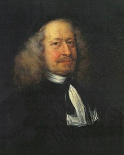
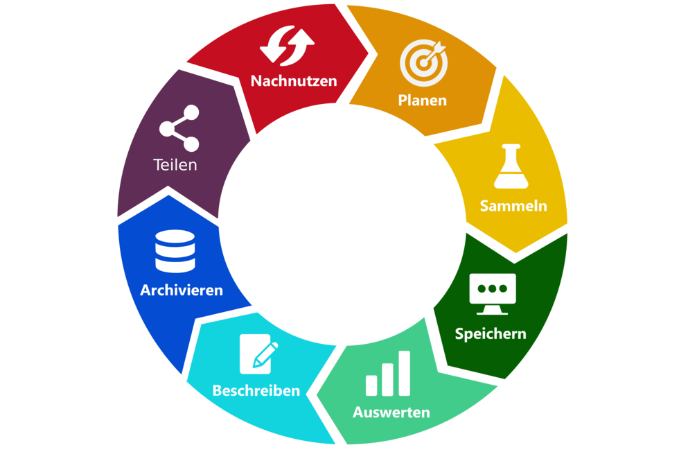
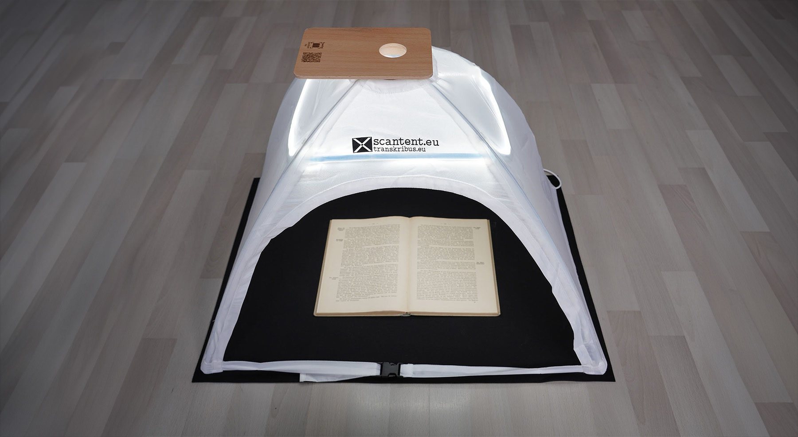
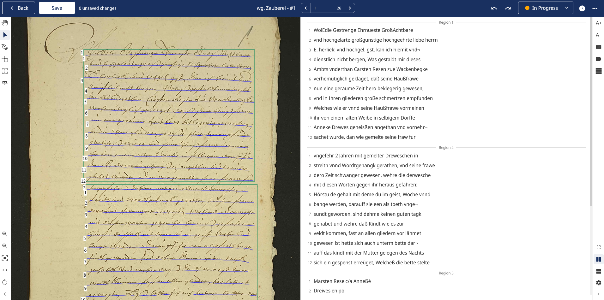
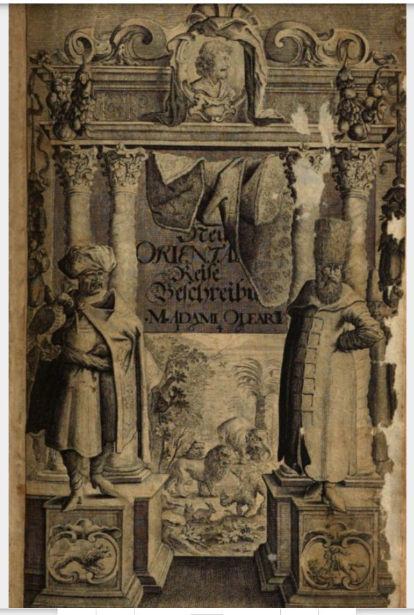
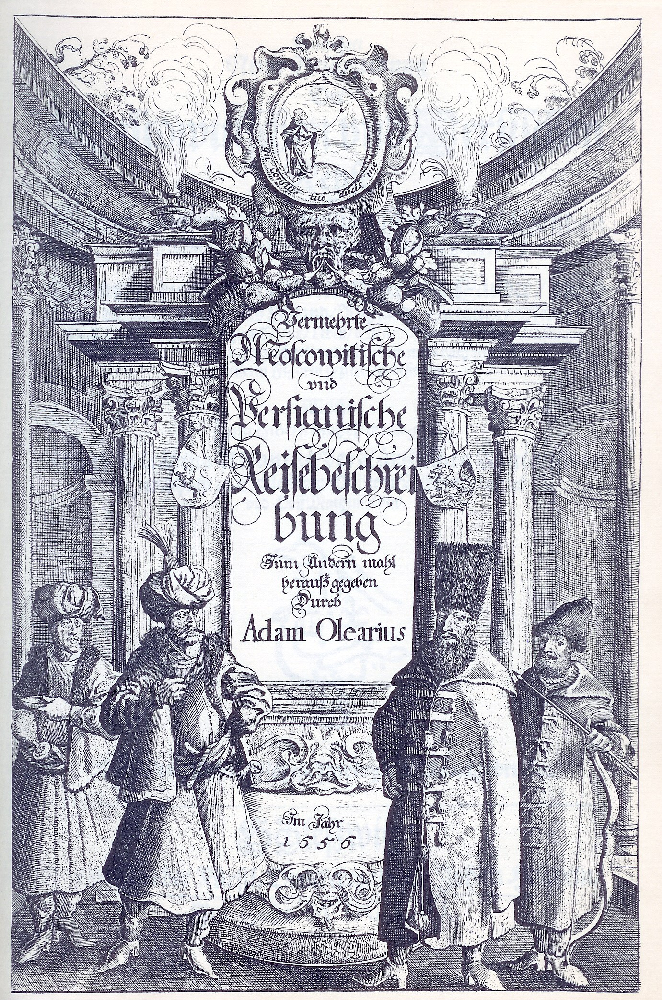
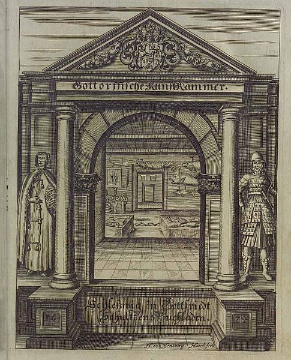
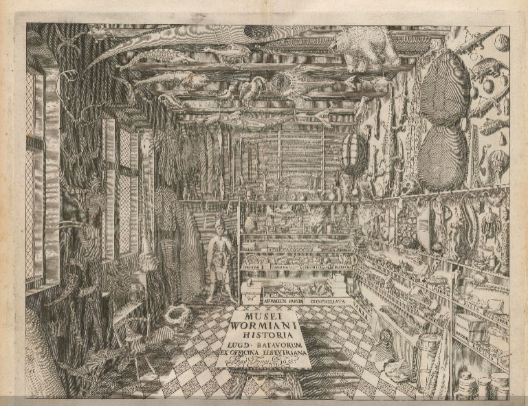
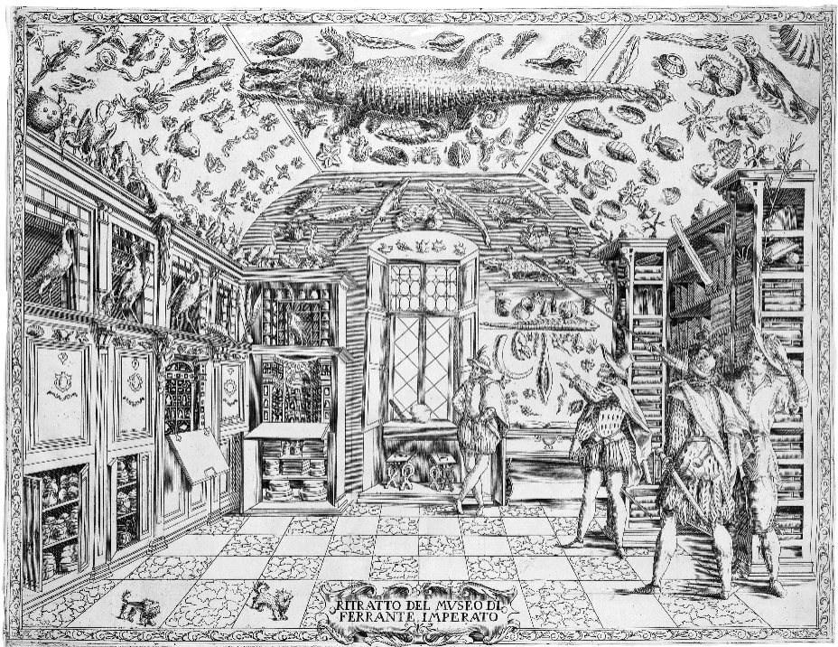

<!--

author: Swantje Piotrowski, Gregor Große-Bölting
email:  ggb@informatik.uni-kiel.de
version: 0.1
language: en
narrator: UK English Female

-->

# Mapping Adam Olearius (1599-1671)

**Reiseberichte, Sammlungen und Wissensräume digital verknüpft** 

Projektseminar zur Geschichte der Neuzeit

**Dozierende:**

* Dr. Swantje Piotrowski, M.A.
* Dr. Gregor Große-Bölting, M.A., M.A.

**Zeit und Raum:** Do 10:15 - 11:45, UB Kiel, DLL

**Inhalt:**

Die Gottorfer Kunst- und Wunderkammer zählt zu den bedeutendsten enzyklopädischen Sammlungen der Frühen Neuzeit. Gegründet um 1650 unter Herzog Friedrich III. und maßgeblich geprägt durch Adam Olearius, verband sie Naturalia, Artificialia, Exotica und wissenschaftliche Instrumente zu einem komplexen Modell von Welt, Natur und menschlicher Entwicklung. Ein zentraler, bislang nur teilweise erschlossener Bestandteil dieser Sammlung sind jene Objekte, die Olearius von der großen Gesandtschaftsreise nach Russland und Persien (1633–1639) nach Gottorf mitbrachte. Im Auftrag des Herzogs reiste eine 36-köpfige Gesandtschaft von Hamburg über Moskau bis nach Isfahan, um Handelsprivilegien zu erwerben. Olearius’ erstmals 1647 veröffentlichte Reisebeschreibung (erweitert 1656) gilt als eine der frühesten wissenschaftlichen Reisebeschreibungen Europas. Das praxisorientierte Projektseminar setzt genau an dieser Schnittstelle an. Ziel ist es, jene Objekte der Gottorfer Kunst- und Wunderkammer zu identifizieren, zu kontextualisieren und zu analysieren, die im Zusammenhang mit der Gesandtschaftsreise stehen. Auf Grundlage des Reiseberichts sowie ergänzender Quellen (Inventare, Kataloge, zeitgenössische Berichte) wird untersucht, wie Reiseerfahrungen, Naturbeobachtungen und kulturelle Begegnungen in konkrete Sammlungsobjekte überführt wurden und welche Bedeutung diesen innerhalb der Kunstkammer zukam. Ein weiterer Schwerpunkt des Seminars liegt auf der raum-zeitlichen Visualisierung der Reise und der Objekte. Der Reisebericht von Olearius wird interaktiv in Raum und Zeit erschlossen, indem Textstellen mit Datumsangaben sowie geographischen Informationen verknüpft werden. 

**Lernziele:**

* fachwissenschaftliche Einordnung der Quellen
* vertiefte fachwissenschaftliche Kenntnisse 
* Methodenkompetenz im Bereich der Digital Humanities
* Visualisierung und Präsentation der Forschungsergebnisse
* Erfahrungen in den Berufs- und Praxisfeldern Wissensvermittlung
* eigenständiges und selbstorganisiertes Arbeiten

**Weiterführende Links und Literatur:**

* Haberland, Detlef (Hg.): Olearius, Adam Moskowitische und Persische Reise: Die holsteinische Gesandtschaft beim Schah 1633 – 1639, Stuttgart-Wien 1986
  
## Allgemeines und erste Sitzung

### Semesterplan

**Termine:**

| Datum  | Thema/Inhalt                                      | 
|--------|---------------------------------------------------|
| 16.04. | Begrüßung, Organisatorisches, Erwartungen, Fragen |           
| 23.04. | **HINTERGRUND:** Welt- und Seinserfahrung. Das Barockzeitalter als Epoche der Entdeckungen und Erfindungen | 
| 30.04. | Von der Entdeckungsreise zur Forschungsreise: Die persianische und moscuwitische Reisebeschreibung von Adam Olearius | 
| 07.05. | Wunderkammern, Sammlungen und materielle Objekte in den Geschichtswissenschaften |
| 14.05. | FEIERTAG - KEIN SEMINAR |
| 21.05. |  |
| 28.05. | **DIGITAL HUMANITIES:** Daten und Metadaten / Visualisierungen |
| 04.06. | Geodaten (GIS) und Arbeiten mit Recogito |
| 11.06. | TEI XML / Close und Distant Reading |
| 18.06. | Photogrammetrie und 3D-Druck |
| 25.06. | **PRAXISPHASE / PROJEKT**   |
| 02.07. | Arbeitssitzung |
| 09.07. | Abschlusssitzung / Präsentationen |

### Forschungs(daten)zyklus

#### ScanTent

#### Transkribus

#### TEI XML: Datenannotation

#### Analyse: Netzwerke, Zeitverläufe, GIS

### Prüfungsleistung

Details folgen im Laufe des Semesters.

### "Regierungserklärung"

1. Diese Veranstaltung ist eine Forschungswerkstatt: Wir setzen neue Methoden und Software ein. Seien Sie also nachsichtig mit uns und mit sich selbst, wenn mal etwas nicht funktioniert wie geplant. Lassen Sie uns zeitnah wissen, wenn Sie Probleme haben, dann findet sich für alles eine Lösung!
2. Weil es sich um eine Forschungswerkstatt handelt, erwarten wir Eigenengagement und Eigeninitiative für das Thema: Sie werden an verschiedenen Stellen selbst recherchieren, arbeiten und experementieren müssen. Im Gegenzug unterstützen wir Sie, wo wir können.
3. Es kann sein, dass Sie in Ihren Quellen wenig oder gar keine biographischen Details finden: Das ist auch ein Ergebnis, dessen Dokumentation einen Wert hat!
4. Der Seminarplan ist "im Fluss".

### Aufgabe zur nächsten Woche

* Strack, Thomas: Exotische Erfahrung und Intersubjektivität. Reiseberichte im 17. und 18. Jahrhundert. Genregeschichtliche Untersuchung zu Adam Olearius – Hans Egede – Georg Forster. Kasseler Studien zu deutschsprachigen Literaturgeschichte Bd. 2, Paderborn, 1994, S.57-71
* Freund, Winfried: Abenteuer Barock. Kultur im Zeitalter der Entdeckungen, Darmstadt, 2004.

## Sitzung am 24.04.
* Besuch von Jessica Bruns, Leiterin des Altbestands der UB, zur Besichtigung der Originalquelle von Adam Olearius Reisebeschreibung aus dem Jahr 1647.

## Sitzung am 30.04.

#### Titelkupfer der Reisebschreibung 1647

#### Titelkupfer der Reisebschreibung 1656

#### Erläuterung
Die beiden kunstvollen Titelkupfer dienen als Einstieg in die von Olearius beschriebenen fremden Kulturen. Das Titelkupfer von 1647 präsentiert eine reich verzierte Ädikula, die nicht nur dekorativen Charakter besitzt, sondern zugleich die vielschichtigen Ideen des Barock widerspiegelt. Auf dem Giebel erscheint Olearius selbst und inszeniert sich damit als Chronist, Künstler und Repräsentant seines Werkes. Flankiert wird die Szenerie von einem persischen Schah und einem russischen Bojaren, die die zentralen kulturellen Räume der Reise symbolisieren. Ihre detailreich ausgearbeiteten Gewänder und Attribute – etwa die Fuchsmützen des Bojaren oder die prächtige Kleidung des Schahs – verweisen auf die jeweiligen kulturellen Besonderheiten. Wappen unterhalb der Figuren betonen die politischen Identitäten, während ihre Fußstellungen gezielt auf Herkunft und Macht verweisen. Ergänzende Symbole wie der Falke des Schahs als Zeichen von Ehre und Herrschaft sowie der Knes hinter dem Bojaren als Vertreter des russischen Adels vertiefen die ikonographische Aussage und unterstreichen die repräsentative Funktion des Bildes.

Quelle: Yosra Mostafa Nagi (1. Mai 2025). Olearius’ Persianische Reisebeschreibung, https://doi.org/10.58079/13xzq

#### Gruppenarbeit
Bilden Sie vier Arbeitsgruppen. Jede Gruppe erhält eine individuelle Aufgabe, die Sie über den folgenden Link zum Conceptboard erreichen.

* Gruppe 1: Adam Olearius als Reisender, Schriftsteller und Herausgeber. Gliedern Sie Olearius Leben in verschiedene Abschnitte und legen dabei den Fokus auf die Zeit der Gesandtschaftsreise und der Veröffentlichung der Reisebeschreibung: https://app.conceptboard.com/board/0pa3-2tm2-dp9n-581a-f6fb
* Gruppe 2: Kontext Quellenpassagen. Sammeln und gliedern Sie die in der vorliegenden Forschungsliteratur genutzten Quellenapssagen / Zitate aus der Reisebeschreibung: https://app.conceptboard.com/board/d76p-ntgc-sabp-sryg-n1sb
* Gruppe 3: Die Eröffnung eines neuen Handelswegs und die Etappen der Gesandtschaft: https://app.conceptboard.com/board/6dqx-xeda-d217-7q85-fcuo
* Gruppe 4: Von der Entdeckungsreise zur Forschungsreise. Warum spricht man bei Olearius Reisebeschreibung erstmals von einem Bericht, der einem Übergang von einer reinen Entdeckungsreise hin zu einer Forschungsreise widerspiegelt? https://app.conceptboard.com/board/a26o-xbyh-r5fd-rpyk-x19z

### Aufgabe zur nächsten Woche
* Bente Gundestrup: Adam Olearius and the Kunstkammer, in: Kirsten Baumann/Constanze Köster/Uta Kuhl: Adam Olearius. Neugier als Methode (Tagungsband zur internationalen Tagung „Der Gottorfer Hofgelehrte Adam Olearius. Neugier als Methode?“, Schleswig 2015). Michael Imhof Verlag, Petersberg 2017, S. 185-193.

## Sitzung am 07.05.
Adam Olearius und die Gottorfische Kunstkammer

Link zum Sammlungskatalog "Die Gottorfische Kunst-Cammer", Adam Olearius, 1666: https://www.digitale-sammlungen.de/de/view/bsb10051222?page=161

Ansicht der Kunst- und Wunderkammer von Ole Worm, Kupferstich aus Willum Worm, Musei Wormiani Historia, Leiden 1655

Ansicht des Museums Faesch von Remigius Faesch (1595–1667)

### Die Gottorfer Kunstkammer
Die Gottorfer Kunst- und Naturalienkammer, die von Herzog Friedrich III. unter Adam Olearius im Jahre 1650 angelegt wurde, visualisiert zum einen die Landschaft in ihrer physikalischen Form (Naturalia) und erzeugt zeitgleich ein Bild, wie sie durch menschliche Künste und Kräfte in ihrem Zustand verändert und geformt wird (Artificialia). Ihr Anspruch war der Zeiterscheinung folgend, die universelle Beziehung aller Dinge, von Kunst und Natur, von Historie und Wissenschaft, darzustellen. Das System, das Adam Olearius in der Gottorfer Kunstkammer durch die Sammlungsgegenstände und ihrer Ordnung entwarf, lässt sich anhand der folgenden Formulierung aus seinem Werk zur Gottorfer Kunstkammer verdeutlichen:
"durch das Kleine was Grosses andeuten und zu verstehen geben".  

#### Wissensordnung 
Im Unterschied zu den heutigen Museen wurden die Objekte der Kunstkammern, ob Kunstwerke, präparierte Tiere, Pflanzen, Fossilien, Messinstrumente und ethnographisches Material, in einem Sammlungsraum gemeinsam präsentiert. Somit verbanden sie wissenschafts- und sozialgeschichtliche Aspekte, deren Funktionen aus ganz unterschiedlichen Blickwinkeln betrachtet werden können. Kunstkammern dienten zum einen der Repräsentation von Gegenständen und bildeten demnach eine der frühen Formen des musealen Sammelns. Zum anderen bot die Kunstkammer auch Gelegenheit zum direkten Studium am Objekt und bildete mit der Bibliothek in direkter Nachbarschaft einen Mittelpunkt wissenschaftlicher Vernetzung. Häufig lehnte sich die räumliche Organisation der Exponate und die Ordnung des Wissens an Konzepte antiker Gedächtniskunst an. 

#### Konzept der Kunstkammer: Mikro-/Makrokosmos
Mit dem im 16. Jahrhundert aufkommenden neuen wissenschaftlichen Verständnis für die Welt, scheint sich die Aufmerksamkeit von der Erschaffung der Welt hin zur umfassenden Darstellung der Schöpfung und ihres Seins zu bewegen. Um sich einem "hier und jetzt" zu versichern, d.h. sich der Stellung des Menschen in der Welt bewusst zu werden, verwiesen die gesammelte Objekte der Kunstkammer auf einen übergeordneten Sinn-Zusammenhang und stellen den Menschen mit seiner Umwelt in ein Beziehungsnetz. Diese sogenannte Mikrokosmos-Makrokosmos-Analogie bildete ein wesentliches Element der Naturphilosophie in der Frühen Neuzeit und hatte sich gegenüber der Theologie einen Raum geschaffen.  Die Theorie zur Entstehung der Welt baute zwar weiterhin auf ein scholastisches System auf, war aber nicht mehr rein theologisch motiviert. Die Interpretation der "weltlichen" Erscheinungen rückte in das Blickfeld der Gelehrten. Der Mensch als Mikrokosmos stand entsprechend mit vielen Signaturen in Korrespondenz zu solchen aus dem Makrokosmos. Aus dieser Interaktion des Menschen mit der ihn umgebenden Landschaft folgten Analogien, die zum Beispiel "die Pflanzen der Erde als Behaarung oder ihre Felsen als Knochen beschrieben."  

#### Objekte und Kategorien
Die einzelnen Gegenstände und mit ihnen der Mensch traten fernwirkend miteinander in Kontakt und beeinflussten sich gegenseitig. Die Kunstkammern waren nach Samuel Quicchebergs Theorie in ein vierstufiges System eingebunden, das die Naturalia über die Artificialia zu den Exotica und Scientificia gegliederte und sie zu einer Einheit verband.

##### Systematik nach Samuel Quiccheberg
Quicchebergs Modell ist unterteilt in:
* Religiöse Kunst und Geschichte, die Genealogie des Stifters und Porträts des Herrscherhauses, topographische Darstellungen des Landes, militärischen Operationen und Zeremonien,  Architektur, Modelle von Maschinen.
* Skulpturen und Numismatik sowie damit verbundene Kunstformen.
* Naturproben, naturhistorische Sammlungen, Kunstobjekte und Ethnographica.
* Wissenschaftliche und mechanische Instrumente.
* Gemälde und grafische Werke, Edelsteine, Spiele und Unterhaltung, Heraldik, Textilien und Objekte aus der lokalen Region. 

##### Das Inventar von 1710
Das Inventar von 1710 ist in die folgenden Hauptgruppen gegliedert, von denen einige Untergruppen haben:
1. Pretiosa
2. Uhren
3. Gemälde
4. Skulptur
5. Antiquitäten
6. Naturalien
7. Gewehr und Opfer-Gerätschaft
8. Der Schrank zu mathematischen Instrumenten. Oben auf dem Schrank. Unten im Schrank. Beim Schrank. In der Mitte auf dem Tisch
9. Kleider
10. Sachen, die unter vielen Rubriken gehören

